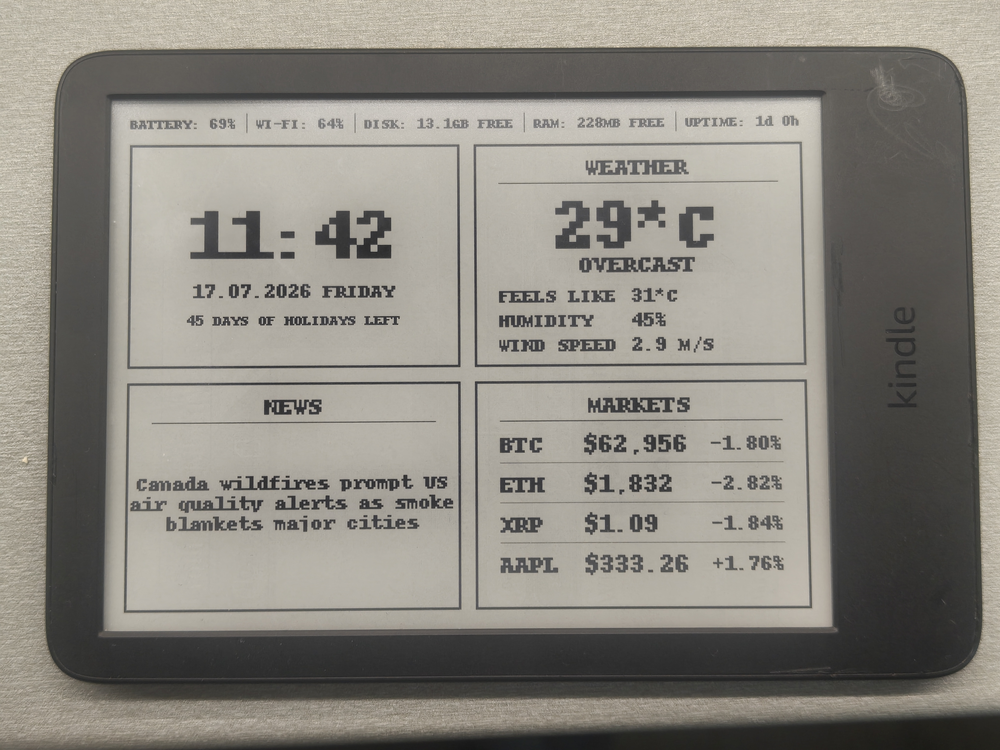

.

# Features
- <b>Time Block:</b>
    - Showing current time (refreshes every 1m)
    - Showing date in dd.MM.YEAR and Curent day of week
    - Showing how much days are left of holidays

- <b>Weather Block</b>
    - Showing temperature, clouds, feel temperature, Humidity, and wind speed in city set in the code

- <b>News Block</b>
    - Showing latest news from rss set in the code
    - Every 1h downloads few new news and replaced old one
    - Every one min changing showed news from storage

- <b>Markets Block</b>
    - Showing current price and 24h % change of BTC, ETH, XRP crypto coins and Apple stock

- <b>Kindle System statistics</b>
    - Showing All sort of system information on status bar at the top:
        - Battery percentage
        - WiFi strenght signal
        - How much disk space is free
        - How much RAM space is free
        - Uptime 

##### In future:
    - Want to add touch support for stopwatch for example
    - make it as KUAL aplication for easy startup and shutdown
    - More slides that i will change by sliding with finger
    - Some sort of macro pad, like i press button on this dashboard and on my PC an app opens or somthing like this
