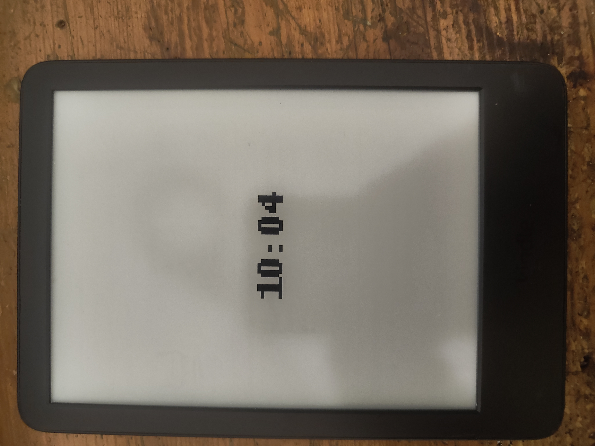
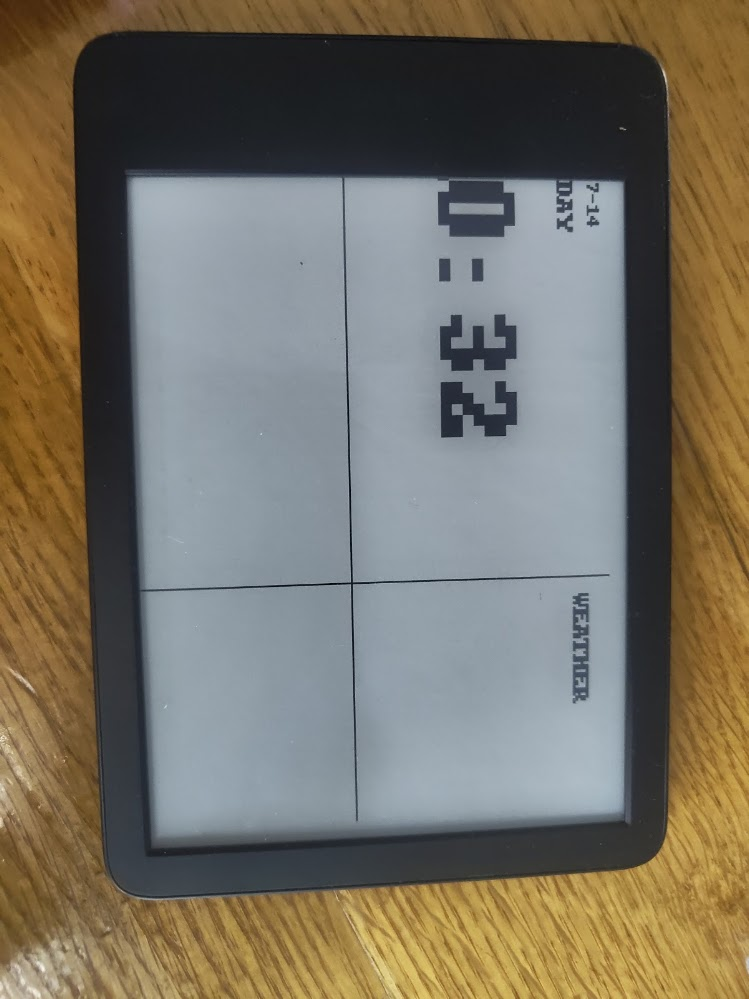
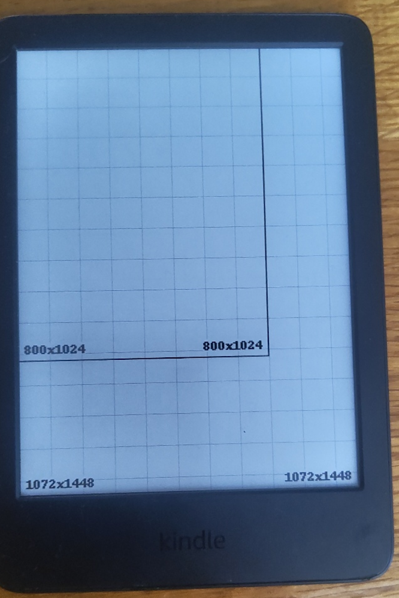
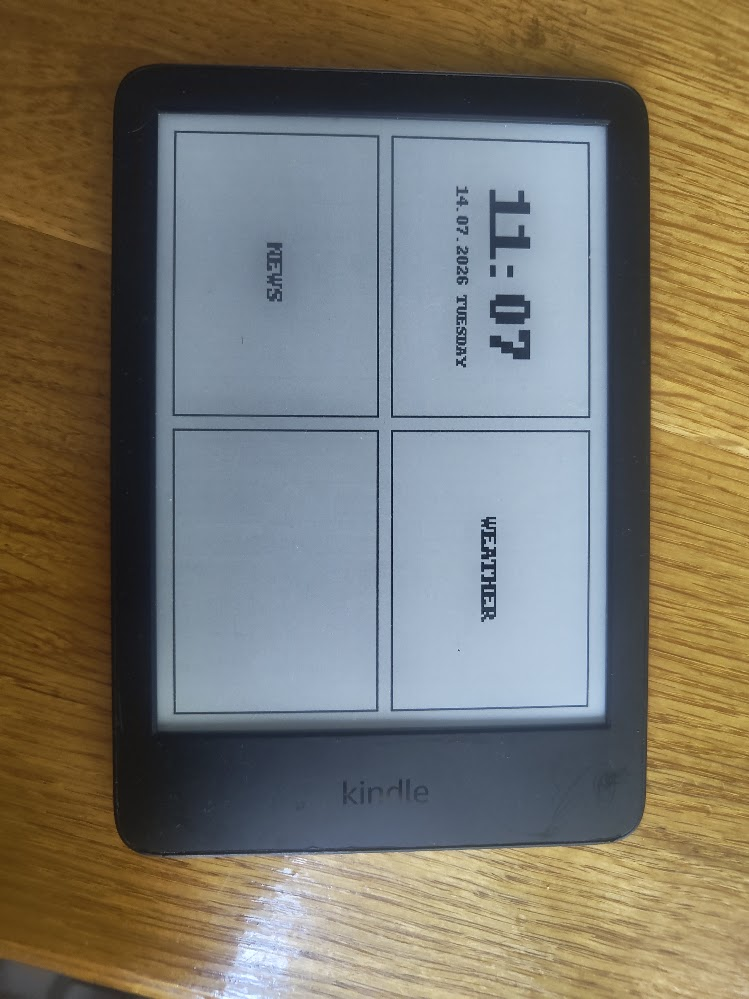
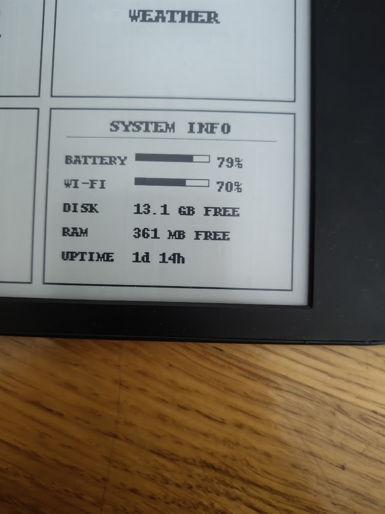

### Basic Clock (1h)
- I learned how to use eips, and with help of png drawing a ceated simple clock that refreshes every 1m. Just starting out with this : )
- The library functions and logic is pretty easy to understand once you get familiar with it and make a lot of mistakes : )
- 

### First Layout, Better clock and other
- The first whing i did today and it took me a lot of time, was making a script to determine what resolution is my screen beacause the layout i made was never centered. So it looked like this:
     so I writed a script that showed me the resolution: .
- Now the basic layout looks like this: 
- I also fixed some issues that the kindle clock, battery and wifi icon appeared on top of my dashbaord somtimes. So i just killed the procees on background for it :) 

- Then I finished making kindle system info block with avvll kind of informations. The challange here was to make the progress bars on Battery and Wifi, and in overall drawing the graphics and symbols. But now it look really good. 
- Now i need to finish the news and weather block wchich will be kinda hard :) 